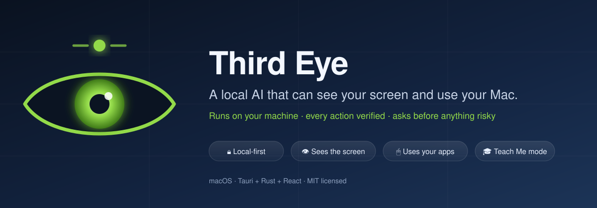
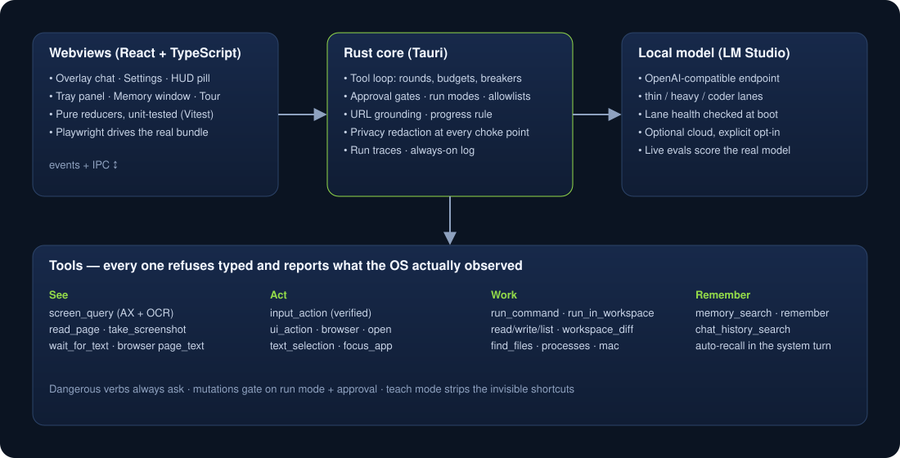

<p align="center">
  
</p>

<p align="center">
  <a href="LICENSE"></a>
  <a href=".github/workflows/ci.yml"></a>
  
  
  <a href="https://iokig.com/third-eye"></a>
</p>

**Third Eye** is a summonable overlay for macOS that pairs a *local* language model with real eyes and hands: it reads what is on your screen, drives your apps with the mouse, keyboard and accessibility APIs, runs commands, edits code in your workspace, and remembers what matters — while every action is verified against what the OS actually did, and anything risky asks first.

It is built for one machine, one person, and a model running on that machine. Nothing leaves your Mac unless you explicitly turn on a cloud provider.

> Status: early, actively developed, used daily by its author. Expect rough edges. Issues and PRs welcome — see [Contributing](#contributing).

---

## What it does

| | |
|---|---|
| **Summon it anywhere** | A global hotkey opens a glass panel at the screen edge. Ask in plain language; watch it work in a HUD trail that names every step. |
| **It sees the screen** | `screen_query` reads the focused window through the accessibility tree first and on-device OCR second, and returns real click targets. Window-scoped by default, so it is fast. |
| **It uses your apps** | Clicks, typing, drags, shortcuts — plus `ui_action` (press a button *by name*), `browser` (Chrome tabs and page DOM), `text_selection` (the text you highlighted, in any app), `open`, `find_files`, `processes`, and `mac` (notifications, Shortcuts, Calendar, Reminders, Notes). |
| **Every action is verified** | Each input action returns what the OS observed afterwards: where the cursor really is, which app holds focus, whether the text landed. A wrong-app readback flips the result to a typed failure the model must react to. |
| **It asks before anything risky** | Three run modes (Off / Ask / Auto-run), per-kind session grants, a persistent command allowlist — and a set of dangerous verbs (`sudo`, `rm`, `kill`, `git push`, uploads, pipe-to-shell…) that **always** ask, no matter what. |
| **Teach Me mode** | Flip a toggle and it stops using invisible shortcuts: keyboard and mouse only, narrated as it goes, ending with a numbered "do it yourself" recap. |
| **It codes** | A coder lane with workspace tools (`read_file`, `write_file`, `run_in_workspace`, `workspace_diff`), a VS Code extension that shows the agent's edits live, and a `thirdeye` CLI/TUI. |
| **It remembers** | A local memory store (SQLite) with categories, tags, pins, per-memory expiry and a knowledge graph. Facts ride the system turn automatically. Chat transcripts are redacted at capture. |
| **It measures itself** | Deterministic evals pin the safety gates; `make evals-live` scores the *real* model on canonical asks; every run leaves a copyable report. |

<p align="center">
  
</p>

## Quick start

**Requirements:** macOS 14+, Apple Silicon recommended, and [LM Studio](https://lmstudio.ai) serving a tool-capable chat model on `http://localhost:1234` (a 9B Qwen-class instruct model with tool use is a good start).

**Install a release:** grab the latest DMG from [Releases](https://github.com/slastrina/third-eye/releases), drag *Third Eye* to Applications, open it. Unsigned builds need a right-click → *Open* the first time.

**Or build from source:**

```sh
git clone https://github.com/slastrina/third-eye.git
cd third-eye
npm install
make install-app        # release build → /Applications/Third Eye.app → relaunch
```

On first launch a four-step tour walks through the permissions Third Eye needs and why:

- **Accessibility** — to read UI elements and synthesize input (off until you arm it in Settings).
- **Screen Recording** — to read the screen. Capture is on-device; frames are never stored.
- **Automation** (prompted on first use) — for Chrome, Calendar, Reminders, Notes.

Then press the hotkey and ask something small: *"what's on my screen?"*, *"open a terminal and run `ls`"*, *"find my tax return pdf"*.

## How it stays safe

Third Eye's design rule is **structure over prose**: instructions in a prompt are advisory to a small local model; only structural gates reliably change behaviour. So the guarantees live in code, not in the system prompt:

- **Typed refusals.** Every tool failure has a kind (`approval-denied`, `ungrounded-url`, `verification-failed`, `too-many-opens`, `repeated-call`, …) and the model is told the action did not happen.
- **Grounding.** A click needs coordinates from a screen read; a navigation needs a URL the user gave or the model read on a page. Guessed targets are refused.
- **Budgets and breakers.** A per-run open budget earned back by reading, a search budget, a repeat breaker, and a stuck breaker that forces a text answer when the model loops.
- **Privacy at the choke points.** Secrets, card numbers and keys are redacted before anything is stored; a fail-closed guard refuses non-local endpoints unless cloud is explicitly opted in.
- **Consent, not containment.** Tools work anywhere; writing or running somewhere new asks for the directory first; `/tmp` is always free.

Read more in [`docs/TECH-STACK.md`](docs/TECH-STACK.md) and the design specs under [`specs/`](specs/).

## Development

```sh
npm install
make dev            # Vite + Tauri dev build with hot reload
make test           # vitest + cargo test
make check          # fmt, clippy -D warnings, tsc
npx playwright test # e2e against the real bundle
make evals          # deterministic behavioural evals
make evals-live     # score the model served by LM Studio (TE_EVAL_MODEL=<id>)
```

The repo is a Tauri v2 app: `src-tauri/` is the Rust core (tools, gates, memory, capture), `src/` the React webviews, `vscode-extension/` the editor companion, `specs/` the spec-driven design log. Live probes for OS behaviour live in `src-tauri/examples/`.

Signing is off in the tracked config. To sign local builds, create an untracked `local.mk`:

```make
export APPLE_SIGNING_IDENTITY := Developer ID Application: Your Name (TEAMID)
```

## Contributing

Contributions are welcome — bug reports with a copied *run report* (each finished answer has a "copy run report" link) are gold. See [CONTRIBUTING.md](CONTRIBUTING.md) for the workflow, the test battery every change runs, and the doctrine that keeps the model honest. Security issues: [SECURITY.md](SECURITY.md).

## Roadmap

- Windows and Linux backends behind the existing `InputControl` / `ScreenQuery` seams
- Safari support for the browser tool
- Voice in/out
- A skills marketplace on top of the markdown skill packs

## About

Third Eye is made by [slastrina](https://github.com/slastrina). Notes, write-ups and other projects live at **[iokig.com](https://iokig.com)** — the [Third Eye page](https://iokig.com/third-eye) has the story behind it.

Licensed under the [MIT License](LICENSE).
